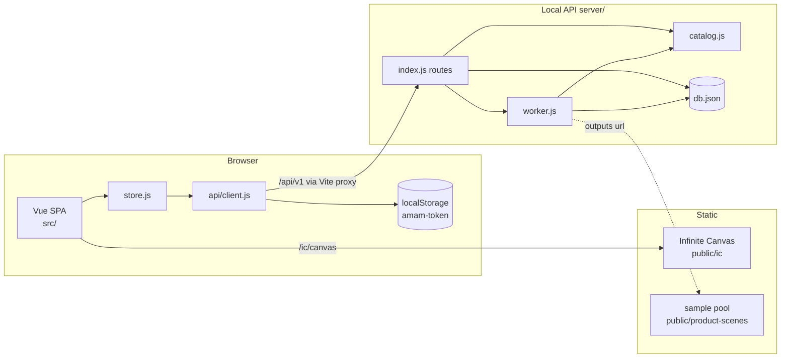
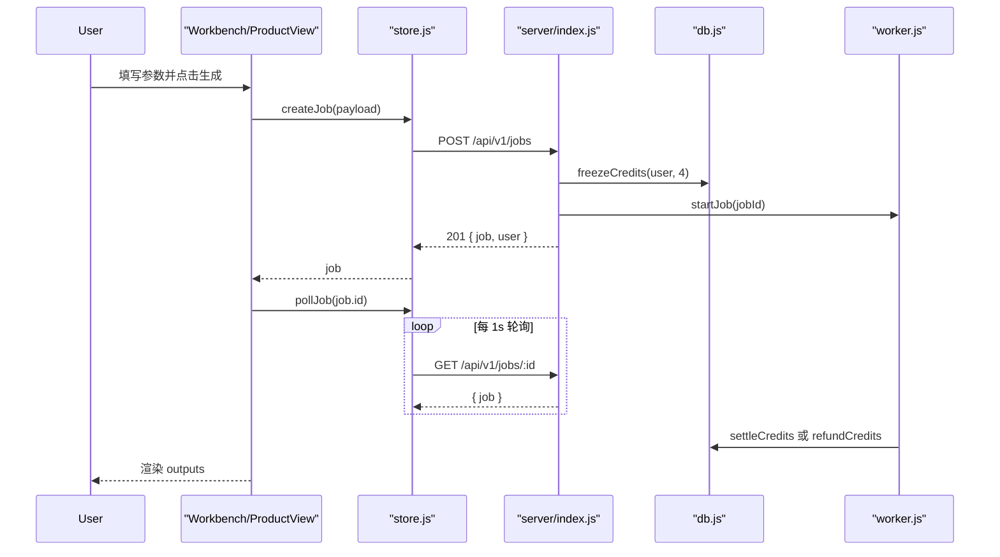
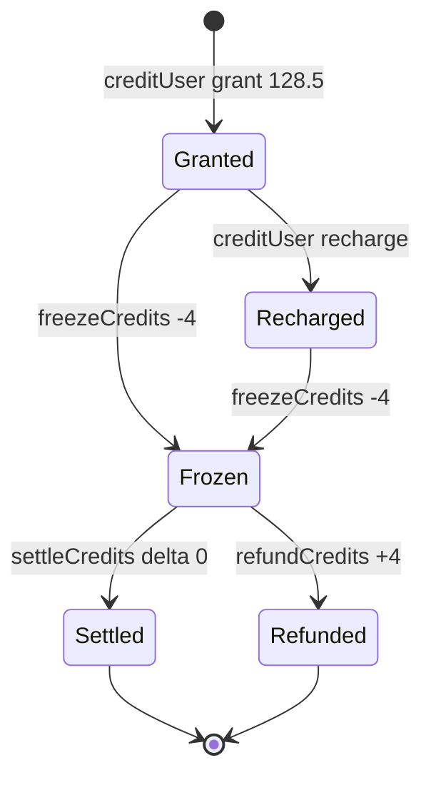

# 系统架构

## 概述

amam 是一个 AI 视觉创作平台的前端应用（复刻 [aigc.easysu.cn](https://aigc.easysu.cn/)），面向电商商家与内容创作者，帮助他们把商品素材快速转化为主图、套图、场景图、模特图、视频与平面设计物料。前端基于 Vue 3 + Vite 构建为单页应用（SPA），覆盖商品图中心、模特图、AI 视频、图片工具、平面设计、图片 POD、爆款衍生、营销场景与跨境上架等业务入口。

平台采用「前端 SPA + 本地生成 API」的两层结构。前端负责路由、目录展示、参数收集与结果渲染；生成请求统一提交到 `server/` 目录下零第三方依赖的 Node HTTP API，由 API 负责账号、积分、任务与素材登记。API 使用一个假 Worker（fake worker）异步推进任务状态并产出示例图片，因此本阶段无需接入真实模型厂商。

账号态与积分不再保存在浏览器本地，而是以服务端会话为准。用户登录后获得服务端令牌，令牌存于 `localStorage` 的 `amam-token`，前端通过 Bearer 头携带令牌访问受保护接口。积分变化全部记录在服务端账本（ledger）中，余额始终等于流水累计值。

无限画布（Infinite Canvas）作为一个独立构建的静态子应用挂在 `/ic/` 路径下，前端通过 `/ic/canvas` 跳转进入，不会合成第二套 Vite 构建，也不使用 iframe 嵌入。主应用与画布子应用共享同一域名与静态资源服务。

## 技术栈

**语言与运行时**
- JavaScript (ES Modules)，Node.js（服务端，无第三方运行时依赖）
- HTML / CSS

**框架**
- Vue `^3.5.13`（`<script setup>` 单文件组件）
- Vue Router `^4.5.0`（`createWebHistory`）
- Vite `^6.0.7` + `@vitejs/plugin-vue` `^5.2.1`

**数据存储**
- 本地 JSON 文件 `server/data/db.json`（users / sessions / jobs / orders / ledger）
- 浏览器 `localStorage`（仅保存会话令牌 `amam-token`）

**基础设施**
- Vite 开发服务器（端口 5173），`/api` 反向代理到本地 API（`http://127.0.0.1:8787`）
- 自定义 Vite 中间件：`/ic/` 路由重写与 `/ic/assets/*.js|.css` 的 gzip 预压缩文件服务
- `allowedHosts: ['.monkeycode-ai.online']` 以支持在线预览域名

**外部服务**
- 当前阶段不集成真实模型厂商；模型列表为静态目录，生成结果为内置样图池
- 静态资源目录：`public/product-scenes/samples/`（样图）、`public/business/models/`（模特图）、`public/ic/`（无限画布子应用）

## 项目结构

```
workspace/
├── index.html                 # SPA 挂载点
├── vite.config.js             # Vite 配置、/api 代理、/ic 中间件、gzip
├── package.json               # 脚本：dev / build / preview / server
├── README.md                  # 快速启动说明
├── server/                    # 本地生成 API（零第三方依赖）
│   ├── index.js               # HTTP 入口、路由分发、鉴权
│   ├── db.js                  # JSON 持久化与积分账本
│   ├── worker.js              # 假 Worker 状态推进
│   ├── catalog.js             # 场景契约、模型列表与样图池
│   └── data/db.json           # 运行时数据（gitignore）
├── src/
│   ├── main.js                # 应用启动 + bootstrap
│   ├── App.vue                # 仅含 RouterView
│   ├── router.js              # 全部路由定义
│   ├── store.js               # 全局响应式 store 与服务端会话
│   ├── api/client.js          # fetch 封装、令牌注入、ApiError
│   ├── layouts/
│   │   └── PublicLayout.vue   # 顶栏导航、弹窗挂载、画布预取
│   ├── views/                 # 各业务页面
│   ├── components/            # 图标、Logo、登录/充值/搜索/帮助组件
│   ├── data/                  # 目录与契约数据
│   │   ├── catalogs.js        # 商品图/模特图/视频/工具/平面等目录
│   │   ├── sceneSchemas.json  # 场景契约（50 个场景的表单/schema）
│   │   ├── business.js        # 业务分类读取辅助
│   │   └── business.json      # 业务分类数据
│   └── styles/base.css        # 设计令牌与基础样式
└── public/
    ├── ic/                    # 无限画布静态子应用（独立构建产物）
    ├── product-scenes/samples/ # 生成结果样图池
    └── business/models/       # 模特广场图片
```

**入口点**
- `src/main.js` - 创建 Vue 应用、挂载路由、调用 `bootstrap()` 恢复会话
- `src/router.js` - 路由定义与目录数据绑定
- `server/index.js` - API 启动（`npm run server`，默认监听 `0.0.0.0:8787`）
- `vite.config.js` - 开发/预览服务器与 `/ic` 中间件

## 子系统

### 前端 SPA 与路由
**目的**: 提供多业务入口的页面与交互
**位置**: `src/`
**关键文件**: `src/router.js`, `src/layouts/PublicLayout.vue`, `src/main.js`
**依赖**: `src/store.js`, `src/data/*`
**被依赖**: 无（顶层应用）

### 全局会话与任务 Store
**目的**: 管理登录态、积分与任务列表，封装服务端调用
**位置**: `src/store.js`, `src/api/client.js`
**关键文件**: `src/store.js`, `src/api/client.js`
**依赖**: `src/api/client.js`
**被依赖**: `src/layouts/PublicLayout.vue`, `src/views/*`, `src/components/LoginModal.vue`, `src/components/PayModal.vue`

### 业务目录与场景契约
**目的**: 定义各业务分类、场景与场景表单 schema
**位置**: `src/data/`
**关键文件**: `src/data/catalogs.js`, `src/data/sceneSchemas.json`, `src/data/business.js`, `src/data/business.json`
**依赖**: 无
**被依赖**: `src/router.js`, `src/layouts/PublicLayout.vue`, 业务视图

### 工作台与生成表单
**目的**: 收集参数与参考素材，提交生成任务并轮询渲染结果
**位置**: `src/views/`
**关键文件**: `src/views/ProductSuiteView.vue`, `src/views/ProductSceneView.vue`, `src/views/WorkbenchView.vue`
**依赖**: `src/store.js`, `src/data/sceneSchemas.json`
**被依赖**: `src/router.js`

### 本地生成 API
**目的**: 提供账号、积分、素材与任务接口
**位置**: `server/`
**关键文件**: `server/index.js`, `server/catalog.js`
**依赖**: `server/db.js`, `server/worker.js`, `src/data/sceneSchemas.json`, `src/data/catalogs.js`
**被依赖**: 前端经 `/api` 代理访问

### 积分账本与持久化
**目的**: 持久化全部实体并保证积分可审计
**位置**: `server/db.js`
**关键文件**: `server/db.js`
**依赖**: Node `fs`, `crypto`
**被依赖**: `server/index.js`, `server/worker.js`

### 假 Worker
**目的**: 异步推进任务状态、产出样图、结算或退款
**位置**: `server/worker.js`
**关键文件**: `server/worker.js`
**依赖**: `server/catalog.js`, `server/db.js`
**被依赖**: `server/index.js`

### 无限画布子应用
**目的**: 提供独立的画布创作界面
**位置**: `public/ic/`
**关键文件**: `public/ic/index.html`, `public/ic/assets/*`
**依赖**: 独立构建产物
**被依赖**: `src/layouts/PublicLayout.vue`（导航跳转与预取）, `vite.config.js`（路由重写与 gzip）

## 图表

### 系统架构



### 生成任务时序



### 积分状态流转


