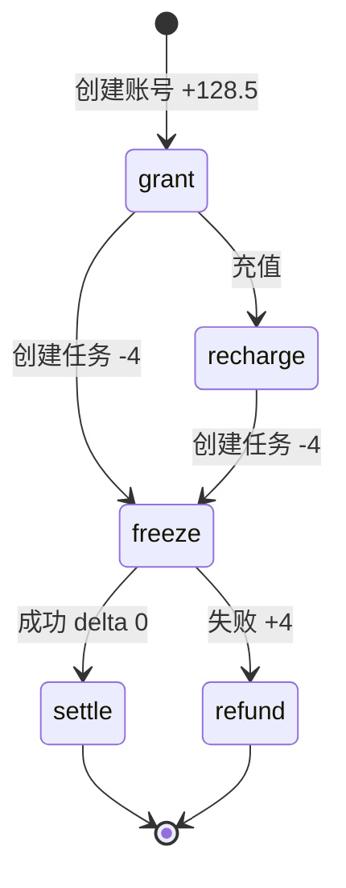
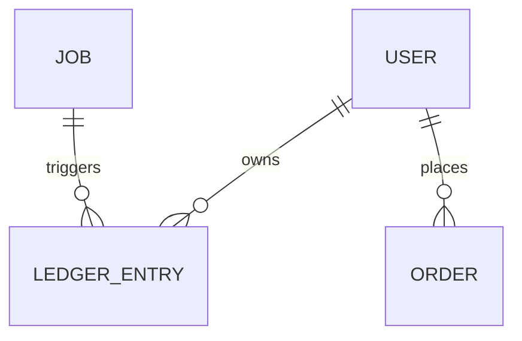

# Credits 与 Ledger（积分账本）

Ledger（流水）是积分变化的唯一事实来源。用户余额必须始终等于其流水累计值，任何积分增减都通过账本函数完成。

## 什么是 Ledger？

Ledger 是记录每一次积分变化的追加式流水集合。用户注册赠送、充值、任务冻结、结算与退款都会写入一条流水。系统通过 `reconcileLedger()` 在启动时校验并对历史数据补齐差额，从而保证「余额 = 流水累计」。

**关键特征**:

- 追加式记录，不修改历史条目
- 每条流水带 `reason` 区分来源
- 支持负向（`freeze`）与正向（`refund`、`recharge`、`grant`）变化
- 结算写入 `delta = 0` 的流水用于留痕

## 代码位置

| 方面 | 位置 |
|------|------|
| 结构定义 | `server/db.js`（`addLedger`） |
| 账本操作 | `server/db.js`（`creditUser`、`freezeCredits`、`settleCredits`、`refundCredits`） |
| 一致性校正 | `server/db.js`（`ledgerTotal`、`reconcileLedger`） |
| 触发点 | `server/index.js`（注册/充值/创建任务）、`server/worker.js`（结算/退款） |
| 接口 | `GET /api/v1/me`、`POST /api/v1/orders` |

## 结构

```js
{
  id: 'led_...',     // 唯一标识
  userId: 'usr_...', // 所属用户
  delta: -4,         // 积分变化（可为 0）
  reason: 'freeze',  // 来源
  jobId: 'job_...',  // 关联任务（可能为 null）
  createdAt: 0       // 时间
}
```

### 关键字段

| 字段 | 类型 | 描述 | 约束 |
|------|------|------|------|
| `id` | `string` | 唯一标识 | `led_` 前缀 |
| `userId` | `string` | 所有者引用 | 必须存在于 `users` |
| `delta` | `number` | 变化量 | 保留两位小数 |
| `reason` | `enum` | 来源 | `grant` / `recharge` / `freeze` / `settle` / `refund` / `adjust` |
| `jobId` | `string \| null` | 关联任务 | 仅任务相关流水有值 |

### reason 取值

| reason | 触发 | delta |
|--------|------|-------|
| `grant` | 登录自动创建账号 | `+128.5` |
| `recharge` | `POST /orders` | `+credits` |
| `freeze` | `POST /jobs` 创建任务 | `-4` |
| `settle` | Worker 任务成功 | `0` |
| `refund` | Worker 任务失败 | `+4` |
| `adjust` | 启动时校正历史数据 | 差额 |

## 不变量

1. **余额等于流水累计**: 对任意用户，`user.credits == sum(ledger.delta where userId == user.id)`。
2. **任务不重复结算/退款**: 同一 `jobId` 只会出现一次 `settle` 或 `refund`。
3. **账本只增不改**: 历史流水条目不被修改或删除。

## 生命周期



## 关系



| 关联概念 | 关系 | 描述 |
|---------|------|------|
| User | 属于 | 每条流水属于一个用户 |
| Job | 关联 | 任务流水通过 `jobId` 关联 |
| Order | 关联 | 充值同时写入 `orders` 与 `ledger` |
