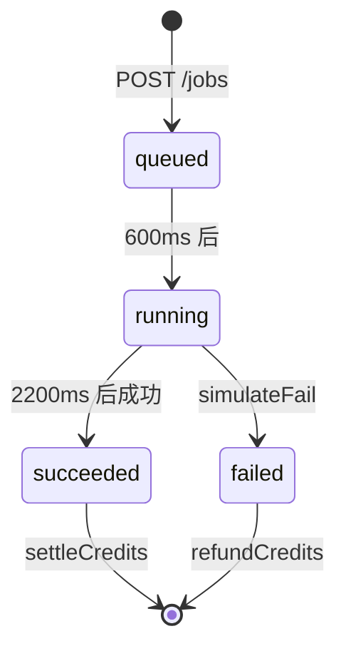
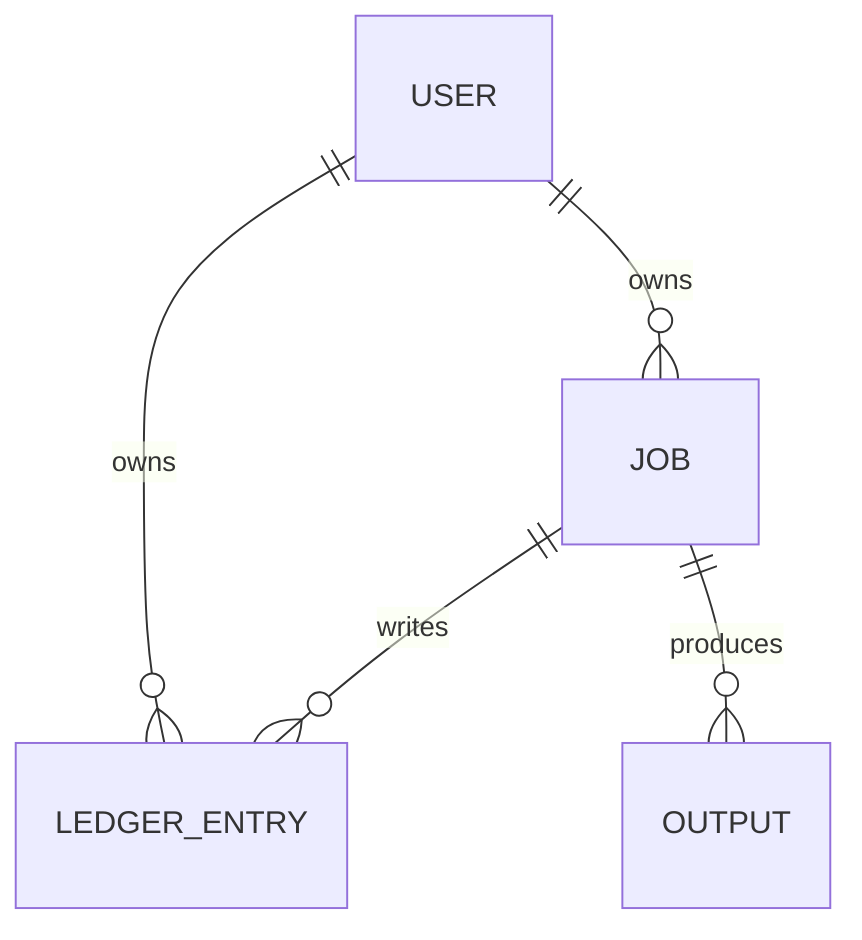

# Job（生成任务）

Job 表示一次生成请求的服务端记录，是前端工作台与服务端之间的核心契约。它把场景、模型、参数、参考素材、状态与输出聚合到一个可轮询、可删除的实体上。

## 什么是 Job？

Job 代表「一次生成请求」从创建到结束的完整生命周期。用户在工作台提交参数后，服务端创建一条 `queued` 状态的 Job，由假 Worker 异步推进到 `running`，最终变为 `succeeded` 或 `failed`。前端通过轮询 `GET /jobs/:id` 获取最新状态与输出。

**关键特征**:

- 与用户强绑定，按令牌隔离
- 创建时立即冻结固定积分（`COST_PER_JOB = 4`）
- 成功产出样图，失败自动退款
- 输出数量由 `params.outputCount`（或 `params.count`）决定

## 代码位置

| 方面 | 位置 |
|------|------|
| 结构定义 | `server/index.js`（`POST /api/v1/jobs` 内构造） |
| 状态推进 | `server/worker.js`（`startJob`、`finish`） |
| 接口 | `server/index.js`（`/api/v1/jobs` 系列路由） |
| 前端提交 | `src/views/ProductSuiteView.vue`、`src/views/ProductSceneView.vue`、`src/views/WorkbenchView.vue` |
| 前端轮询 | `src/store.js`（`createJob`、`pollJob`、`deleteJob`） |

## 结构

```js
{
  id: 'job_...',          // 唯一标识
  userId: 'usr_...',      // 所属用户
  scene: '商品主图',        // 场景（slug 或 title）
  model: 'seedream-4.0',  // 模型 id
  params: {},             // 场景参数，含 outputCount
  refs: [],               // 参考素材 [{ role, name, url }]
  cost: 4,                // 冻结积分
  status: 'queued',       // 状态
  progress: 0,            // 进度（假 Worker 仅设置 0.4）
  outputs: [],            // [{ index, url }]
  error: null,            // 失败原因
  createdAt: 0,           // 创建时间
  startedAt: null,        // 进入 running 的时间
  finishedAt: null        // 结束时间
}
```

### 关键字段

| 字段 | 类型 | 描述 | 约束 |
|------|------|------|------|
| `id` | `string` | 唯一标识 | `job_` 前缀，不可变 |
| `userId` | `string` | 所有者引用 | 必须存在于 `users` |
| `scene` | `string` | 场景标识 | 必须命中已知场景集合 |
| `cost` | `number` | 冻结积分 | 固定 `COST_PER_JOB` |
| `status` | `enum` | 当前状态 | `queued` / `running` / `succeeded` / `failed` |
| `params.outputCount` | `number` | 期望输出数量 | 1–12，越界会被钳制 |
| `outputs` | `array` | 生成结果 | 仅成功时填充 |

## 不变量

1. **创建即冻结**: Job 创建与 `freezeCredits` 在同一请求内完成。
2. **单次结算**: 每个 Job 只会结算或退款一次（Worker 通过 `status` 守卫）。
3. **失败退款**: 状态为 `failed` 时，冻结积分必须已返还。
4. **令牌隔离**: 用户只能查询、删除属于自己 `userId` 的 Job。

## 生命周期



### 状态描述

| 状态 | 描述 | 允许的转换 |
|------|------|-----------|
| `queued` | 已创建、等待执行 | → running |
| `running` | 执行中 | → succeeded, failed |
| `succeeded` | 成功，已结算，产出 `outputs` | 终态 |
| `failed` | 失败，已退款，带 `error` | 终态 |

## 关系



| 关联概念 | 关系 | 描述 |
|---------|------|------|
| Session / User | 属于 | 每个 Job 属于一个用户 |
| Ledger Entry | 产生 | 创建/结算/退款各写入一条流水 |
| Scene Contract | 引用 | `scene` 必须命中场景契约 |
