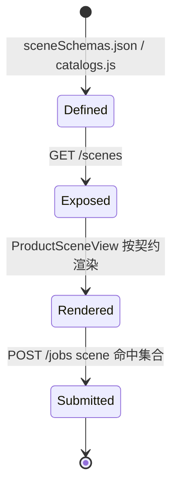
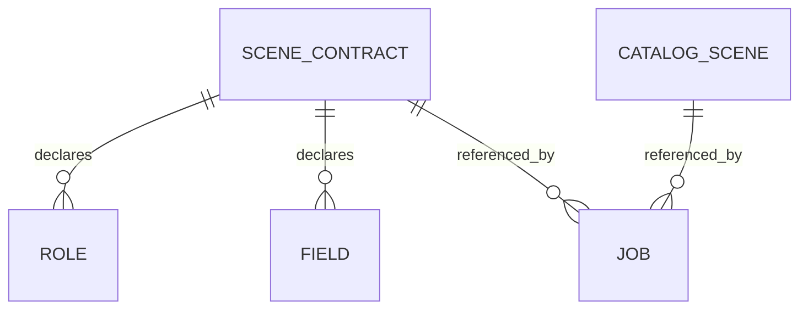

# Scene Contract（场景契约）

场景契约描述一个生成场景需要哪些参考素材角色、哪些表单字段，以及默认的产出模式。它是工作台动态渲染输入区与服务端校验场景有效性的共同依据。

## 什么是 Scene Contract？

场景契约是 `src/data/sceneSchemas.json` 中定义的对象集合，共 50 个场景。每个契约声明该场景的 slug、标题、分组、参考素材角色（`roles`）、表单字段（`fields`）、最大输出数（`maxOutputs`）、默认比例（`defaultRatio`）、产出模式（`outputMode`）与提示说明（`instruction`）。业务目录（`src/data/catalogs.js`）则描述更广的场景清单（覆盖视频、工具、POD、爆款衍生等，共约 128 个场景）。

**关键特征**:

- 契约数据为静态 JSON，前后端共用
- `slug` 与 `title` 均唯一，可作为场景标识
- 服务端校验取 `sceneSchemas.json` 与 `catalogs.js` 的并集
- 工作台 `ProductSceneView` 依据契约动态渲染输入表单与结果区

## 代码位置

| 方面 | 位置 |
|------|------|
| 契约数据 | `src/data/sceneSchemas.json` |
| 业务目录 | `src/data/catalogs.js` |
| 服务端读取 | `server/catalog.js`（`sceneSchemas`、`getScene`） |
| 契约接口 | `server/index.js`（`GET /api/v1/scenes`） |
| 前端消费 | `src/views/ProductSceneView.vue` |

## 结构

```json
{
  "slug": "suite",
  "title": "商品套图",
  "group": "...",
  "description": "...",
  "roles": [ { "key": "product", "min": 1 } ],
  "maxOutputs": 4,
  "defaultRatio": "3:4",
  "outputMode": "...",
  "fields": [ { "key": "...", "type": "...", "label": "..." } ],
  "instruction": "..."
}
```

### 关键字段

| 字段 | 类型 | 描述 | 约束 |
|------|------|------|------|
| `slug` | `string` | 场景唯一标识 | 唯一，路由参数使用 |
| `title` | `string` | 展示名称 | 唯一，可作为 `scene` 提交值 |
| `roles` | `array` | 参考素材角色 | 含 `key`、`min` |
| `fields` | `array` | 表单字段 | 驱动输入区渲染 |
| `maxOutputs` | `number` | 最大输出数 | 影响可选结果数量 |
| `defaultRatio` | `string` | 默认画面比例 | 如 `3:4` |

## 不变量

1. **标识唯一**: `slug` 与 `title` 在各自集合内唯一。
2. **提交有效**: `POST /jobs` 的 `scene` 必须命中 `sceneSchemas` ∪ `catalogs`。
3. **共源**: 前端目录与服务端校验共享同一份数据文件，避免漂移。

## 生命周期



## 关系



| 关联概念 | 关系 | 描述 |
|---------|------|------|
| Job | 被引用 | Job 的 `scene` 指向一个场景标识 |
| Catalog | 并列来源 | `catalogs.js` 提供更广的场景集合 |
