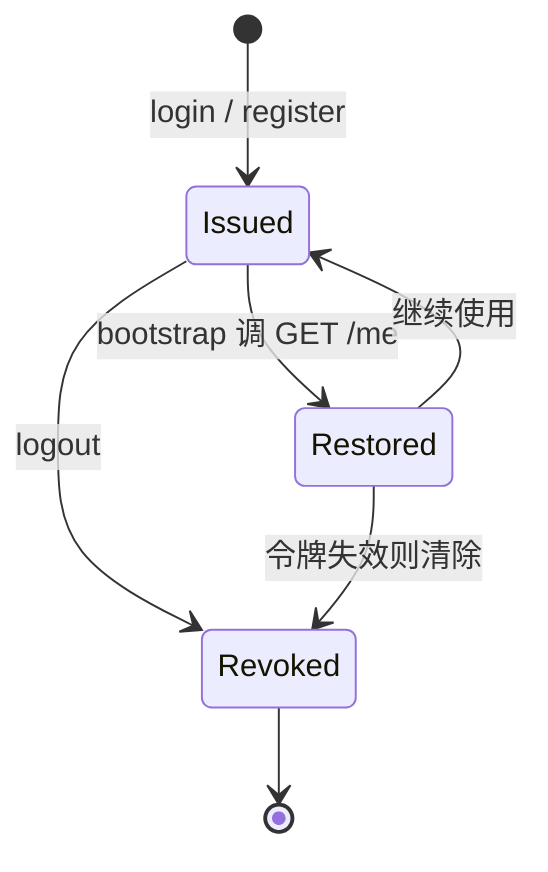
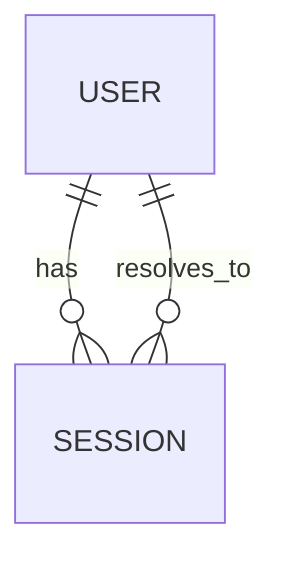

# Session（会话）

Session 表示一次登录后服务端签发的令牌记录。前端把令牌保存在 `localStorage`，受保护接口通过 `Authorization: Bearer <token>` 解析出当前用户。

## 什么是 Session？

Session 是服务端 `sessions` 集合中的一条记录，把随机令牌映射到用户。登录与注册都会签发新令牌；注销会删除令牌。前端 `bootstrap()` 在启动时用本地令牌调用 `GET /me` 验证并恢复登录态，失败则清除令牌。

**关键特征**:

- 令牌格式为 `tok_` + 随机串
- 无过期时间，注销或服务端删除后失效
- 多个令牌可同时存在（同一用户可多次登录）
- 令牌只标识用户，不携带权限范围

## 代码位置

| 方面 | 位置 |
|------|------|
| 结构定义 | `server/index.js`（`issueToken`） |
| 鉴权解析 | `server/index.js`（`currentUser`） |
| 登录/注册/注销 | `server/index.js`（`/api/v1/auth/*`） |
| 前端保存 | `src/api/client.js`（`getToken`、`setToken`） |
| 会话恢复 | `src/store.js`（`bootstrap`） |

## 结构

```js
{
  token: 'tok_...',   // 令牌
  userId: 'usr_...',  // 所属用户
  createdAt: 0        // 签发时间
}
```

### 关键字段

| 字段 | 类型 | 描述 | 约束 |
|------|------|------|------|
| `token` | `string` | 会话令牌 | `tok_` 前缀，作为 `sessions` 的键 |
| `userId` | `string` | 关联用户 | 必须存在于 `users` |
| `createdAt` | `number` | 签发时间 | 毫秒时间戳 |

## 不变量

1. **令牌唯一**: 每次签发产生新的随机令牌。
2. **注销失效**: 注销后原令牌不再能解析出用户。
3. **无令牌不授权**: 缺失或无效令牌访问受保护接口返回 `401 unauthorized`。

## 生命周期



### 状态描述

| 状态 | 描述 | 允许的转换 |
|------|------|-----------|
| `Issued` | 已签发令牌并存于 localStorage | → Restored, Revoked |
| `Restored` | 启动时验证通过并恢复 `store.user` | → Revoked |
| `Revoked` | 已注销或失效 | 终态 |

## 关系



| 关联概念 | 关系 | 描述 |
|---------|------|------|
| User | 属于 | 每个 Session 解析为一个用户 |
| Job | 间接 | 通过 Session 解析出的用户隔离任务 |
