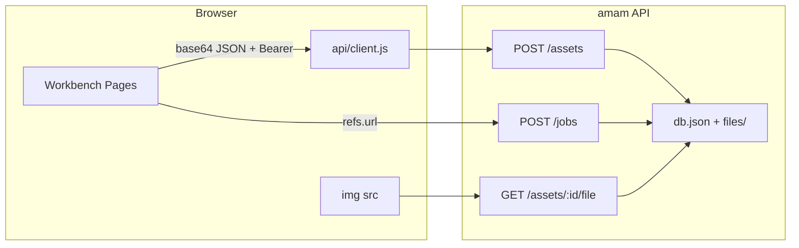

# Asset Persistence

Feature Name: asset-persistence
Updated: 2026-09-24

## Description

把生成参考素材从「浏览器 `blob:` + 空登记」改成服务端持久化。已登录用户以 JSON + base64 上传图片；API 把字节写到与 `db.json` 同级的文件目录，并在 JSON 中记录资产元数据。图片 GET 不要求 Authorization，便于 `` 直接使用 `/api/v1/assets/{id}/file`。商品套图、商品场景、通用工作台在选本地图时上传，任务 `refs` 只接受本人资产 URL 或 `/product-scenes/` 静态样图。本地图片工具仍只在浏览器处理。本阶段不接真实模型厂商。

## Architecture



- 上传走现有 JSON `readBody`，请求字段为 `name`、`role`、`mime`、`data`（原始 base64 或 `data:` URL）。
- 解码后的字节写入 `files/{assetId}.{ext}`，元数据写入 `state.assets`。
- `AMAM_DB_FILE` 指向测试库时，文件目录为该文件所在目录下的 `files/`。
- Vite `server` 与 `preview` 都将 `/api` 代理到 `127.0.0.1:8787`，这样开发与 preview 下的 `` 都能到达 API。

## Components and Interfaces

### API（`server/`）

| 方法与路径 | 认证 | 说明 |
| --- | --- | --- |
| `POST /api/v1/assets` | Bearer | 解码 base64、校验 MIME/大小、落盘、返回 `{ assetId, name, role, url }` |
| `GET /api/v1/assets` | Bearer | 当前用户资产列表 |
| `GET /api/v1/assets/:id/file` | 无 | 返回原始字节与 `Content-Type` |
| `POST /api/v1/jobs` | Bearer | 额外校验每条 `refs[].url` |

`readBody` 原始上限从 8_000_000 调整到 10_485_760（10 MiB），覆盖 6 MiB 原图的 base64 膨胀与 JSON 包装。

允许的 MIME：`image/png`、`image/jpeg`、`image/webp`、`image/gif`。扩展名映射：`png` / `jpg` / `webp` / `gif`。

### 前端（`src/`）

- `api/client.js`：`registerAsset` 改为提交 `{ name, role, mime, data }`；新增 `fileToDataUrl` 辅助或在调用方用 `FileReader`。
- `ProductSuiteView.vue` / `ProductSceneView.vue` / `WorkbenchView.vue`：选择本地文件后先用 `blob:` 做缩略图；已登录则立即上传并把 `preview` 换成服务端 `url`；提交前把仍为本地文件的条目补传。
- 静态样图（`useSample` / `useExample`）继续使用 `/product-scenes/...`，不上传。
- `PhotoEditView` 与其它本地工具不改。
- `vite.config.js`：`preview.proxy` 与 `server.proxy` 相同，转发 `/api` → `http://127.0.0.1:8787`。

未登录时允许先选图并保留本地 `blob:` 预览；点生成先打开登录弹窗。登录成功或提交生成前，Frontend 将尚未上传的本地 `File` 补传，再用返回 URL 写 `refs`。

## Data Models

```txt
Asset { id, userId, name, role, mime, size, file, url, createdAt }
Job.refs[] { role, name, url, assetId?, main? }
```

- `id`：`newId('ast')`
- `file`：相对数据目录的路径，形如 `files/ast_xxx.png`
- `url`：`/api/v1/assets/{id}/file`
- `size`：解码后字节数
- `empty()` 增加 `assets: {}`

磁盘：`dirname(AMAM_DB_FILE || server/data/db.json) + '/files/' + assetId + ext`。

## Correctness Properties

1. 解码后字节数不超过 6 MiB，且 MIME 属于允许列表，才写入资产记录与文件。
2. 资产元数据与图片文件都落在 `AMAM_DB_FILE` 所在目录树内。
3. 创建任务时，每条 `refs[].url` 要么是调用者名下已存在资产的 `/api/v1/assets/{id}/file`，要么以 `/product-scenes/` 或 `/business/` 开头。
4. `GET /api/v1/assets` 只返回令牌对应用户的资产。
5. `GET /api/v1/assets/:id/file` 在记录与文件都存在时返回字节，不要求 Authorization。
6. 同一 `assetId` 对应一条元数据与一个文件；上传失败时不留下半条记录。

## Error Handling

| 状态 | error | 场景 |
| --- | --- | --- |
| 401 | `unauthorized` | 上传或列表缺少有效令牌 |
| 400 | `missing_file` | 无 `data` 或无法解码 |
| 400 | `invalid_mime` | MIME 不在允许列表 |
| 413 | `file_too_large` | 解码后超过 6 MiB |
| 404 | `not_found` | 图片路径或资产不存在 |
| 400 | `invalid_ref` | 任务 refs 含 `blob:`、`data:`、外用户资产或无法解析的 URL |

上传失败时 Frontend 保留已成功条目，对失败条目展示服务端 `error` 文案。

## Test Strategy

1. `npm test` 增加用例（同一 `AMAM_DB_FILE` 隔离）：
   - 登录后 POST 小 PNG（base64）→ 200，磁盘有文件，GET `/file` 字节与 MIME 一致。
   - 无令牌 POST → 401；非法 MIME → 400；超 6 MiB → 413。
   - GET 列表只含本人资产。
    - POST job：`blob:` ref → 400 `invalid_ref`；本人资产 URL、`/product-scenes/samples/...` 与 `/business/models/...` → 201。
2. 手动：登录 → 套图页上传真图 → 缩略图走 `/api/v1/assets/.../file` → 生成成功；刷新后缩略图仍在。
3. 关闭 API 时前端展示上传/生成错误，不白屏。

## References

[^1]: (File) - [server/index.js POST /assets](../../../server/index.js)
[^2]: (File) - [server/db.js](../../../server/db.js)
[^3]: (File) - [src/api/client.js](../../../src/api/client.js)
[^4]: (File) - [ProductSuiteView.vue](../../../src/views/ProductSuiteView.vue)
[^5]: (Spec) - [generation-job-pipeline](../generation-job-pipeline/design.md)
