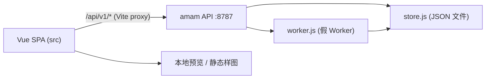

# Generation Job Pipeline

Feature Name: generation-job-pipeline
Updated: 2026-09-22

## Description

为 amam 前端补上一套最小可用的生成任务管线：新增 Node.js BFF（`amam API`），提供认证、积分、素材引用与任务接口；前端新增 `src/api/` 数据层，把 `store.js` 从纯本地状态改为服务端会话；商品套图页、商品场景页与通用工作台由「`setTimeout` + 随机样图」改为「创建任务 → 轮询 → 渲染结果」；作品/日志页展示服务端任务。

本阶段明确不接真实模型厂商，服务端 Worker 用内置样图模拟异步生成，用于打通链路与验收交互。

## Architecture



- 前端与 API 同源：Vite `server.proxy` 将 `/api` 转发到 `127.0.0.1:8787`，预览环境无需 CORS。
- API 使用 Node 内置 `http` 模块，零运行时依赖，数据落地到 `server/data/db.json`。
- 假 Worker 在任务创建后按定时器推进 `queued → running → succeeded`，产出样图 URL。

## Components and Interfaces

### API 模块（`/workspace/server`）

- `index.js`：HTTP 入口、路由分发、JSON 读写、Bearer 鉴权。
- `db.js`：`server/data/db.json` 的读写与默认结构（`users`、`sessions`、`jobs`、`orders`、`ledger`）。
- `worker.js`：启动任务推进定时器，写入输出与状态。
- `catalog.js`：读取 `src/data/sceneSchemas.json` 提供场景契约与样图池。

| 方法与路径 | 说明 |
| --- | --- |
| `POST /api/v1/auth/login` | 登录，账号不存在时自动创建 |
| `POST /api/v1/auth/register` | 注册 |
| `POST /api/v1/auth/logout` | 注销当前令牌 |
| `GET /api/v1/me` | 返回当前用户与余额 |
| `POST /api/v1/orders` | 充值并返回最新用户 |
| `POST /api/v1/assets` | 登记参考素材元信息，返回 `assetId` |
| `GET /api/v1/scenes` | 返回场景契约摘要 |
| `GET /api/v1/models` | 返回可用模型列表 |
| `POST /api/v1/jobs` | 创建任务并冻结积分 |
| `GET /api/v1/jobs` | 当前用户任务列表 |
| `GET /api/v1/jobs/:id` | 任务详情 |
| `DELETE /api/v1/jobs/:id` | 删除任务记录 |

### 前端模块（`/workspace/src`）

- `api/client.js`：`fetch` 封装、令牌注入、统一错误对象。
- `store.js`：会话态（`user` / `token`）、任务列表、`login` / `register` / `logout` / `recharge` / `createJob` / `pollJob` / `loadJobs` 等动作。
- `components/LoginModal.vue`：调用服务端登录/注册，处理加载与错误。
- `views/ProductSuiteView.vue` / `views/ProductSceneView.vue` / `views/WorkbenchView.vue`：改造 `generate()` 为任务提交与轮询。
- `views/SimplePage.vue`：作品/日志页渲染服务端任务。

## Data Models

```txt
User    { id, name, account, credits, invite, createdAt }
Session { token, userId, createdAt }
Job     { id, userId, scene, model, params, refs, cost, status,
          outputs[], error, createdAt, startedAt, finishedAt }
Order   { id, userId, credits, price, createdAt }
Ledger  { id, userId, delta, reason, jobId, createdAt }
```

`status` 取值：`queued` | `running` | `succeeded` | `failed`。`outputs` 为 `{ url, index }` 数组。

## Correctness Properties

1. 任务创建与积分冻结在同一请求内完成，用户余额始终等于流水累计值。
2. 任务成功结算、失败退款，同一任务不重复结算或退款。
3. 所有任务接口按令牌隔离，用户只能访问自己的任务。
4. 登录/注册对同一账号幂等：再次登录不改变已有用户的积分。
5. 前端在 API 不可用时给出提示，不产生未捕获的 Promise 异常。

## Error Handling

- 未携带或无效令牌访问受保护接口：`401 { error: "unauthorized" }`。
- 参数缺失或场景不存在：`400 { error: "..." }`。
- 积分不足：`402 { error: "insufficient_credits" }`。
- 未知路径：`404 { error: "not_found" }`。
- 前端 `client.js` 将非 2xx 响应转成带 `status` 与 `message` 的异常，由各视图捕获后展示。

## Test Strategy

1. 启动 API 后使用 `curl` 验证登录、创建任务、轮询与充值接口。
2. 在浏览器中完成：登录 → 商品套图生成 → 结果出现 → 余额变化 → 作品页可见任务。
3. 重启 API，确认 `db.json` 持久化后用户余额与任务仍在。
4. 关闭 API，确认前端提交时展示错误而非白屏。

## References

[^1]: (File) - [sceneSchemas.json](../../../src/data/sceneSchemas.json)
[^2]: (File) - [store.js](../../../src/store.js)
[^3]: (File) - [vite.config.js](../../../vite.config.js)
