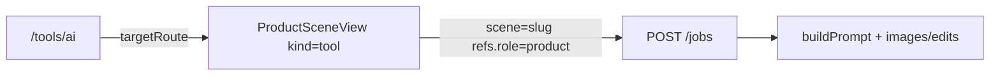

# Image Edit Tools

Feature Name: image-edit-tools
Updated: 2026-10-08

## Description

为 9 个高频单图编辑入口补契约，路由接到 `ProductSceneView`，目录标已接入。Worker、厂商 Key、积分沿用现有管线。有参考图走 `/v1/images/edits`。涂抹消除允许可选蒙版，无蒙版时按文字说明整图编辑。

## Architecture

`/tools/ai/:scene` 的方案页 catch-all 保持在专用工作台路由之后，未接入场景仍显示方案页。

## Components and Interfaces

### 新契约 slug

`ai-edit`、`white-bg`、`cutout-pro`、`upscale`、`upscale-pro`、`outpaint`、`outpaint-pro`、`eliminate-pro`、`remove-watermark`

### 路由

在 `layer-split` / `watermark-pro` 之后为上述 slug 增加 `ProductSceneView` `kind=tool` 路由。

### `business.json` toolbox

上述 9 条：`capability=implemented`，`targetRoute=/tools/ai/{slug}`。

## Data Models

每条默认 `maxOutputs=4`，`outputMode=variants`，`defaultRatio=1:1`。扩图类默认比例 `16:9`。原图角色 `product` 最少 1 张。

## Correctness Properties

1. 9 个 slug 均存在于 `sceneSchemas.json`。
2. 工具目录对应场景 `sceneRoute` 为 `/tools/ai/{slug}`。
3. `POST /jobs` 接受这些 slug。

## Test Strategy

扩展 `tests/generation-pipeline.test.js`：创建 `white-bg` 与 `ai-edit` 任务；断言工具目录 9 条映射。

## References

[^1]: `.monkeycode/specs/scene-contract-logic/design.md`
[^2]: `src/data/business.json` toolbox
