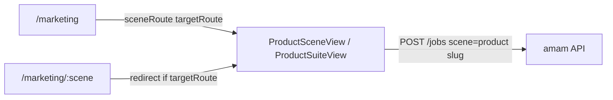

# Marketing Scene Reuse

Feature Name: marketing-scene-reuse
Updated: 2026-10-07

## Description

把营销目录从方案页改为复用已有商品图工作台。14 个营销场景全部标记 `implemented`，`targetRoute` 指向商品图契约页或套图页。目录卡片与 `/marketing/:scene` 都进入目标工作台。不新增营销专用契约、不改 Worker、不改积分。

## Architecture

目录点击已走 `sceneRoute`。补一层路由重定向，避免用户收藏 `/marketing/banner` 仍落在方案页。

## Components and Interfaces

### `src/data/business.json` 营销分类

| slug | targetRoute |
| --- | --- |
| `main-image` | `/product-images/hero-image` |
| `poster-replica` | `/product-images/hot-replica` |
| `social-card` | `/product-images/seeding` |
| `festival` | `/product-images/seeding` |
| `creative-variants` | `/product-images/seeding` |
| `marketing-image` | `/product-images/selling-point` |
| `ai-poster` | `/product-images/selling-point` |
| `image-copy` | `/product-images/selling-point` |
| `popup` | `/product-images/selling-point` |
| `banner` | `/product-images/clothing-ztc` |
| `live-bg` | `/product-images/product-composite` |
| `creator-cover` | `/product-images/main-collage` |
| `graphic-cover` | `/product-images/main-collage` |
| `campaign-kit` | `/product-images/suite` |

每条同时设 `capability: implemented`、`status: 已接入`。`outputHint` 最后一项写明沿用的工作台名称。

### `src/router.js`

`/marketing/:scene` 增加 `beforeEnter`：用 `findBusinessScene('marketing', scene)` 读取 `targetRoute`，有则 `next(targetRoute)`，无则进入 `BusinessScenePlanView`。

### 不改动

- `sceneSchemas.json`、`vendor.js`、积分、视频、本地工具
- `WorkbenchView` 中的 `marketingScenes` 仅作元数据，本阶段不新增营销工作台路由

## Data Models

营销场景对象沿用现有字段：`slug`、`title`、`capability`、`status`、`kind`、`targetRoute`、`preview`、`inputHint`、`outputHint`。

## Correctness Properties

1. 营销分类 14 个场景均为 `implemented`。
2. 每个场景 `sceneRoute` 等于上表 `targetRoute`。
3. 每个 `targetRoute` 的最后一段 slug 能在 `sceneSchemas` 中找到（`suite` 对应套图页）。

## Error Handling

未知 `/marketing/:scene` 仍渲染方案页空状态。目标工作台的登录、积分、上游错误沿用现有逻辑。

## Test Strategy

在 `tests/generation-pipeline.test.js` 增加：

- 读取 `business.json` 营销场景，断言 14 条均已接入且 `targetRoute` 与设计表一致
- 断言 `targetRoute` slug 命中 `sceneSchemas`

## References

[^1]: `.monkeycode/specs/scene-contract-logic/requirements.md` - P0 契约工作台
[^2]: `src/data/business.js` `sceneRoute`
[^3]: `src/views/BusinessScenePlanView.vue` - 已接入时展示前往工作台
