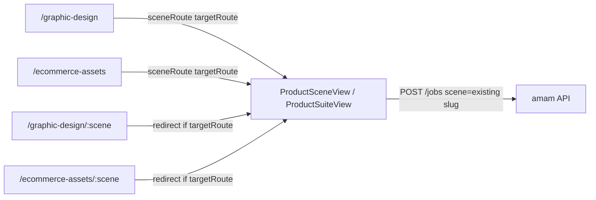

# Poster Ecommerce Reuse

Feature Name: poster-ecommerce-reuse
Updated: 2026-10-09

## Description

把平面设计未落地入口和电商素材可出图入口改为复用已有工作台。平面 6 个场景全部标记 `implemented`；电商素材 11 个出图场景标记 `implemented`，文案/标题保持 `planned`。目录卡片与深链都进入目标工作台。不新增契约、不改 Worker、不改积分。

## Architecture

目录点击已走 `sceneRoute`。补一层路由重定向，避免收藏 `/graphic-design/free-poster` 或 `/ecommerce-assets/param-board` 仍落在方案页。`/graphic-design/print-size` 继续走既有专用工作台路由。

## Components and Interfaces

### `src/data/business.json` 平面设计分类

| slug | targetRoute |
| --- | --- |
| `free-poster` | `/product-images/selling-point` |
| `cover-set` | `/product-images/main-collage` |
| `print-size` | `/graphic-design/print-size` |
| `flyer-fold` | `/graphic-design/print-size` |
| `infographic` | `/product-images/detail-sheet` |
| `design-longform` | `/product-images/detail-page` |

每条同时设 `capability: implemented`、`status: 已接入`。`outputHint` 最后一项写明沿用的工作台名称。

### `src/data/business.json` 电商素材分类

| slug | targetRoute |
| --- | --- |
| `param-board` | `/product-images/detail-sheet` |
| `feature-stack` | `/product-images/selling-point` |
| `usage-scene` | `/product-images/seeding` |
| `compare-chart` | `/product-images/detail-sheet` |
| `size-chart` | `/pod-images/pod-size-image` |
| `package-design` | `/product-images/product-composite` |
| `label-design` | `/graphic-design/print-size` |
| `package-series` | `/product-images/suite` |
| `package-mockup` | `/pod-images/print-mockup` |
| `instruction-card` | `/product-images/detail-sheet` |
| `tag-design` | `/graphic-design/print-size` |

`ai-copywriting` 与 `title-generator` 保持 `planned`，不设 `targetRoute`。

### `src/router.js`

`/graphic-design/:scene` 与 `/ecommerce-assets/:scene` 增加 `beforeEnter`：分别用 `findBusinessScene('graphic-design', scene)` 与 `findBusinessScene('material', scene)` 读取 `targetRoute`，有则 `next(targetRoute)`，无则进入 `BusinessScenePlanView`。`print-size` 专用路由保持在 catch-all 之前。

### 不改动

- `sceneSchemas.json`、`vendor.js`、积分、视频、本地工具
- 文案/标题场景、证件照、涂抹蒙版、视频 live

## Data Models

平面与电商素材场景对象沿用现有字段：`slug`、`title`、`capability`、`status`、`kind`、`targetRoute`、`preview`、`inputHint`、`outputHint`。

## Correctness Properties

1. 平面设计分类 6 个场景均为 `implemented`。
2. 每个平面场景 `sceneRoute` 等于上表 `targetRoute`。
3. 电商素材 11 个出图场景均为 `implemented`，文案 2 个为 `planned`。
4. 每个已接入 `targetRoute` 的最后一段 slug 能在 `sceneSchemas` 中找到（`suite` 对应套图页）。

## Error Handling

未知 `/graphic-design/:scene` 与 `/ecommerce-assets/:scene` 仍渲染方案页空状态。目标工作台的登录、积分、上游错误沿用现有逻辑。文案场景继续展示方案页。

## Test Strategy

在 `tests/generation-pipeline.test.js` 增加：

- 读取 `business.json` 平面场景，断言 6 条均已接入且 `targetRoute` 与设计表一致
- 读取电商素材场景，断言 11 条出图映射与 2 条文案 `planned`
- 断言已接入 `targetRoute` slug 命中 `sceneSchemas`

## References

[^1]: `.monkeycode/specs/marketing-scene-reuse/requirements.md` - P1 营销复用工作台
[^2]: `src/data/business.js` `sceneRoute`
[^3]: `src/views/BusinessScenePlanView.vue` - 已接入时展示前往工作台
