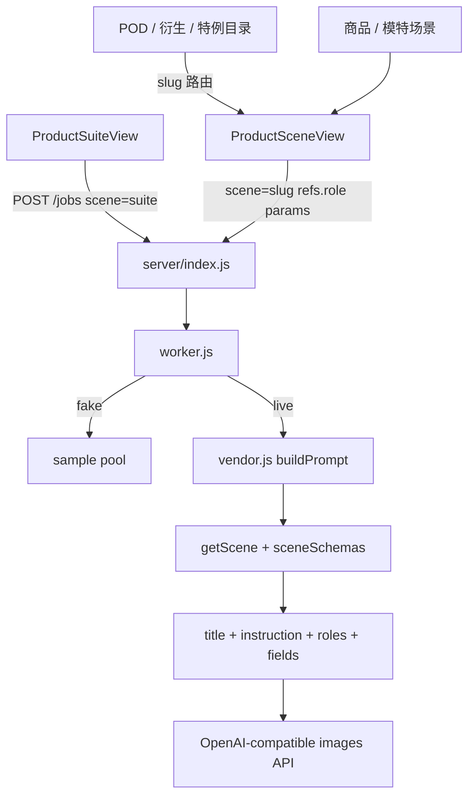

# Scene Contract Logic

Feature Name: scene-contract-logic
Updated: 2026-10-07

## Description

在现有图像代调上补齐场景语义。Worker 按 `sceneSchemas.json` 把 `instruction`、参考图角色与非空表单字段编进上游提示词。POD 15 个场景、爆款衍生 11 个场景、以及图层拆分、去水印 Pro、打印尺寸补契约，路由从通用工作台改到 `ProductSceneView`。商品图 / 模特图 / 套图保持现有页面。视频 live、无限画布、本地工具、营销 P1 不在本规格。

## Architecture

- 任务创建、积分冻结、`refs` 校验、厂商路由沿用 `server-model-proxy`。
- `buildPrompt` 从「场景名 + 少量文本键」升级为「契约驱动组装」。
- 前端提交 `scene` 使用契约 `slug`；`getScene` 继续同时接受 `slug` 与 `title`。
- 图层拆分仍产出栅格图，提示词描述分层关系；本阶段不生成真实 PSD 文件。

## Components and Interfaces

### `src/data/sceneSchemas.json`

在现有 50 条之后追加 29 条契约。每条含 `slug`、`title`、`group`、`description`、`roles`、`fields`、`maxOutputs`、`defaultRatio`、`outputMode`、`instruction`。

角色键沿用现有约定：`product`、`reference`、`model`、`mask`，并新增 `pattern`、`garment-a`、`garment-b`、`inspiration`、`fabric`。

### `server/vendor.js` `buildPrompt(job)`

输入：任务对象。输出：最长 4000 字符的字符串。

组装顺序：

1. `Scene: {title}`
2. 契约 `instruction`
3. 每条 `ref`：`Reference {n} ({roleLabel}): {name}`，`roleLabel` 取契约角色 `label`，缺省用 `role`
4. 契约 `fields` 中非空项：`{label}: {readable}`
5. 无契约时回退：场景名 + `prompt` / `product_info` / `extra_description` / `instruction` / `description`

空值规则：空字符串、空数组、`false`、`null`、`undefined` 省略。`select` / `multiselect` 用选项 `label`。`repeater` 把每行子字段拼成短句，行之间用分号。`checkbox` 仅在 `true` 时写入标签。契约未声明的键只有上述五个文本键允许追加。

`mapSize` / `outputCount` / 参考图加载 / 上游 URL 保持不变。

### `src/router.js`

| 路径 | 现组件 | 目标组件 |
| --- | --- | --- |
| `/pod-images/:scene` | `WorkbenchView` | `ProductSceneView` `kind=pod` |
| `/derive-images/:scene` | `WorkbenchView` | `ProductSceneView` `kind=derive` |
| `/tools/ai/layer-split` | `WorkbenchView` | `ProductSceneView` `kind=tool` |
| `/tools/ai/watermark-pro` | `WorkbenchView` | `ProductSceneView` `kind=tool` |
| `/graphic-design/print-size` | `WorkbenchView` | `ProductSceneView` `kind=graphic` |

`/ai-video/entity-leads` 仍用通用工作台。`WorkbenchView` 继续服务未纳入 P0 的入口。

### `src/views/ProductSceneView.vue`

- 用 `scene` slug 查找契约。
- 提交 `createJob({ scene: schema.slug, model, params, refs })`。
- `kind` 为 `pod` / `derive` / `tool` / `graphic` 时继续包 `SceneWorkbenchShell`（空 `kind` 则无壳）。
- 模型列表保持图像模型；本阶段继续使用第一个图像模型 id，与现有商品 / 模特场景一致。

### `server/catalog.js`

`getScene` 已按 slug / title 查找；`GET /scenes` 直接返回扩容后的 `sceneSchemas`。`catalogScenes` 并集校验保持，避免旧 `title` 提交失败。

### 不改动

- `server/worker.js` 生命周期与积分结算
- `AMAM_VENDOR_*` 凭证与 Key 隔离
- `/ic/`、本地 `PhotoEditView`、视频目录
- 营销 / 跨境 / 学习等方案页

## Data Models

### 提示词字段可读值

| 字段类型 | 写入规则 |
| --- | --- |
| `text` / `textarea` | 去空白后的字符串 |
| `number` | 十进制数字 |
| `select` | 匹配选项的 `label`，找不到则用原值 |
| `multiselect` | 选项标签用顿号连接 |
| `checkbox` | 仅 `true` 时写入标签本身 |
| `color` | `#rrggbb` |
| `repeater` | 每行 `子标签=值`，行间分号 |

### P0 契约摘要

**POD**

| slug | 必填角色 | 关键字段 |
| --- | --- | --- |
| `pattern-extract` | `product` 1 | 图案类型、背景处理、张数 |
| `allover-extract` | `product` 1 | 重复方式、裁切、张数 |
| `seamless-pattern` | `product` 0-1 | 主题描述、密度、色彩、张数 |
| `image-variant` | `product` 1 | 裂变方向、张数 |
| `style-transfer` | `product` 1，`reference` 0-1 | 目标风格、强度 |
| `print-design` | 无必填图 | 主题、用途、色彩 |
| `skin-design` | `product` 1 | 产品品类、贴合方式 |
| `material-bond` | `product` 1，`pattern` 1 | 贴合区域、透视 |
| `print-mockup` | `product` 1，`pattern` 1 | 服装品类、视角 |
| `pod-main-image` | `product` 1 | 平台、卖点 |
| `pod-size-image` | `product` 1 | 尺寸说明、标注语言 |
| `pod-scene-image` | `product` 1 | 生活方式场景 |
| `local-replace` | `product` 1，`mask` 0-1 | 替换说明 |
| `targeted-replace` | `product` 1 | 区域说明、替换内容 |
| `smart-cutout` | `product` 1 | 边缘精度、底色 |

**爆款衍生**

| slug | 必填角色 | 关键字段 |
| --- | --- | --- |
| `style-innovate` | `product` 1 | 创新幅度 |
| `style-fusion` | `garment-a` 1，`garment-b` 1 | 融合比例 |
| `inspired-redesign` | `product` 1，`inspiration` 1 | 保留结构 |
| `fabric-replace` | `product` 1，`fabric` 1 | 保留版型 |
| `color-replace` | `product` 1 | 目标颜色 |
| `season-shift` | `product` 1 | 目标季节 |
| `series-derive` | `product` 1 | 系列单品类型 |
| `part-redesign` | `product` 1 | 改动部位 |
| `tech-sketch` | `product` 1 | 线稿风格 |
| `same-style-reshoot` | `product` 1 | 主体类型、场景 |
| `outfit-matrix` | `product` 2-8 | 场景数量 |

**特例**

| slug | 必填角色 | 关键字段 |
| --- | --- | --- |
| `layer-split` | `product` 1 | 拆分层级 |
| `watermark-pro` | `product` 1 | 水印位置说明 |
| `print-size` | `product` 0-1 | 宽度与高度为文本、单位、主题 |

默认 `maxOutputs` 为 4，`defaultRatio` 为 `1:1`（试穿类衍生用 `3:4`，打印尺寸用 `1:1`）。`outputMode` 均为 `variants`。

## Correctness Properties

1. 命中契约的 live 任务提示词包含该契约 `instruction`。
2. 非空契约字段以标签形式出现在提示词中；空字段不出现。
3. `refs[].role` 对应的角色标签出现在提示词中。
4. 提示词长度不超过 4000。
5. P0 目标场景 `slug` 可通过 `POST /jobs` 创建任务。
6. 同一 `jobId` 仍然只结算或退款一次。
7. 视频模型任务仍返回 `unsupported_model` 并退款。
8. 厂商凭证不出现在任务 JSON 与 API 响应中。

## Error Handling

| 条件 | 行为 |
| --- | --- |
| 未知场景 | 现有 `invalid_scene` 400 |
| 契约缺失但目录命中 | 接受任务，提示词走无契约回退 |
| 必填角色未传 | 前端禁用生成；服务端不新增角色数量校验 |
| 上游失败 / 超时 / 空图 | 沿用 `vendor_error` / `vendor_timeout` / `vendor_empty` 并退款 |
| 视频模型 | `unsupported_model` 并退款 |
| 未登录 | 前端打开登录弹窗 |

## Test Strategy

在 `tests/generation-pipeline.test.js` 增加对导出的 `buildPrompt` 的纯函数用例，以及 fake 模式下的 HTTP 创建用例：

- 商品契约 `change-bg`：提示词含 instruction、`background_mode` 标签、角色「商品图」
- 空 `extra` 不出现在提示词
- `style-fusion` slug 创建任务返回 200
- `pattern-extract` slug 创建任务返回 200
- 现有 fake 成功、`vendor_unconfigured`、`unsupported_model`、超时退款保持通过

手工验收：打开 `/pod-images/pattern-extract`、`/derive-images/style-fusion`、`/tools/ai/watermark-pro` 看到角色上传区；提交后结果区出图或展示既有错误文案。

## References

[^1]: `.monkeycode/specs/server-model-proxy/design.md` - 图像代调与 `buildPrompt` 现状
[^2]: `.monkeycode/specs/scene-contract-logic/requirements.md` - P0 需求
[^3]: `src/data/sceneSchemas.json` - 现有 50 条契约
[^4]: `src/router.js` - POD / 衍生 / 特例路由
[^5]: `server/vendor.js` - `buildPrompt` / `TEXT_KEYS`
