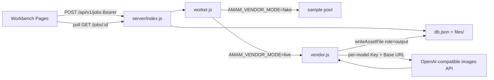

# Server Model Proxy

Feature Name: server-model-proxy
Updated: 2026-10-05

## Description

把假 Worker 的样图产出替换为服务端代调真实图像模型。前端继续只提交场景、模型 id、参数与已持久化的 `refs`；Worker 按模型 id 读取该模型专属的 `AMAM_VENDOR_*` 凭证，用 Node 内置 `http`/`https` 调用上游 OpenAI 兼容图像接口；成功图片落为调用者名下资产，任务 `outputs` 只暴露 `/api/v1/assets/{id}/file`。厂商 Key 不进前端、不进任务 JSON。视频模型返回 `unsupported_model` 并退款。`AMAM_VENDOR_MODE=fake` 时沿用现有样图 Worker，供测试与无上游环境使用。

## Architecture



- 任务创建、积分冻结、`refs` 校验保持现有 `POST /jobs` 行为。
- Worker 在 `queued → running` 后根据 `AMAM_VENDOR_MODE` 分支：`fake` 走样图；缺省或 `live` 走 `vendor.js`。
- 每个图像模型 id 使用独立环境变量组；缺该模型 Key 或 Base URL 时任务 `failed` + `vendor_unconfigured` + 退款，其他已配置模型不受影响。
- 上游响应中的 `b64_json` 或可下载 `url` 转成字节后写入 `files/`，元数据写入 `assets`，`outputs[].url` 为资产文件路径。

## Components and Interfaces

### `server/catalog.js`

`GET /api/v1/models` 与前端 `onlineModels` 对齐：

| id | name | video |
| --- | --- | --- |
| `nano-banana` | Nano Banana | false |
| `nano-pro` | Nano Banana Pro | false |
| `seedream` | Seedream 4.5 | false |
| `gpt-image` | GPT Image 1.5 | false |
| `kling` | Kling 2.1 | true |
| `seedance` | Seedance 1.5 Pro | true |

图像任务只接受上表中 `video=false` 的 id。

### `server/vendor.js`（新增）

职责：读凭证、组提示词、读参考图、发上游请求、解码图像字节。

模型路由（环境变量，占位符由部署方填入，代码不读取 Agent 环境中的 LLM Key）：

| 前端 id | Key | Base URL | 上游 model 名 |
| --- | --- | --- | --- |
| `nano-banana` | `AMAM_VENDOR_NANO_BANANA_API_KEY` | `AMAM_VENDOR_NANO_BANANA_BASE_URL` | `AMAM_VENDOR_NANO_BANANA_MODEL`（缺省 `sensenova-u1.5-fast`） |
| `nano-pro` | `AMAM_VENDOR_NANO_PRO_API_KEY` | `AMAM_VENDOR_NANO_PRO_BASE_URL` | `AMAM_VENDOR_NANO_PRO_MODEL`（缺省 `sensenova-u1.5-lite`） |
| `seedream` | `AMAM_VENDOR_SEEDREAM_API_KEY` | `AMAM_VENDOR_SEEDREAM_BASE_URL` | `AMAM_VENDOR_SEEDREAM_MODEL`（缺省 `sensenova-u1.5-fast`） |
| `gpt-image` | `AMAM_VENDOR_GPT_IMAGE_API_KEY` | `AMAM_VENDOR_GPT_IMAGE_BASE_URL` | `AMAM_VENDOR_GPT_IMAGE_MODEL`（缺省 `sensenova-u1.5-lite`） |

公共开关：

- `AMAM_VENDOR_MODE`：`fake` 或 `live`（缺省 `live`）
- `AMAM_VENDOR_TIMEOUT_MS`：上游等待时限，缺省 `120000`

调用约定（各厂商 Base URL 均按 OpenAI Images 兼容）：

- `refs` 为空：`POST {base}/v1/images/generations`，JSON，`Authorization: Bearer <key>`，字段 `model`、`prompt`、`n`、`size`、`response_format=b64_json`
- `refs` 非空（默认）：`POST {base}/v1/images/edits`，multipart，字段 `model`、`prompt`、`n`、`size`、`response_format=b64_json`，参考图以 `image[]` 文件部分上传（最多 8 张）
- SenseNova（上游 model 以 `sensenova-` 开头，或 Base URL 含 `sensenova.cn`）：generations / edits 均发 JSON；edits 用 `images: [{ image_url: "data:image/...;base64,..." }]`（最多 8 张），并带 `watermark: false`、`prompt_extend: false`。上游 `n` 仅允许 1，需要多张时服务端连打多次 `n=1`。临时 `url` 必须立刻下载落本地资产。提示词末尾固定排版约束：用户未给精确文案时画面不发明文字。
- `n`：`params.outputCount` 或 `params.count`，钳制到 1–8
- `size`：由 `params.ratio` / `params.aspect_ratio` 映射为 `1024x1024`、`1024x1536`、`1536x1024`

提示词：优先 `params.prompt`；否则拼接场景标题与文本类参数（如 `product_info`、`extra_description`、`instruction`），总长上限 4000 字。

### `server/worker.js`

- `startJob` 仍把任务推进到 `running`
- `fake`：现有 `outputsFor` 样图 + `settleCredits`
- `live`：调用 `vendor.generateForJob(job)`；成功则 `persistOutputs` + `settleCredits`；抛出的错误码写入 `job.error` 并 `refundCredits`
- 同一任务仍只结算或退款一次

### `server/db.js`

复用 `writeAssetFile`。Worker 为每张结果创建 `role=output` 的资产，`userId` 为任务发起者。

### 前端

- 工作台继续提交 `onlineModels` 的图像 id；请求体不含 Key
- `src/api/client.js` 增加错误文案：`vendor_unconfigured`、`vendor_error`、`vendor_timeout`、`vendor_empty`、`unsupported_model`
- 轮询成功后仍渲染 `outputs[].url`（现已是资产路径或将变为资产路径）
- `PhotoEditView` 与 `/ic/` 不改

### 仓库配置

- `.env.example` 列出全部 `AMAM_VENDOR_*` 占位符，无真实值
- 运行时 `.env` 不提交

## Data Models

Job 字段保持现有形状。成功时：

```txt
Job.outputs[] { index, url, assetId }
Asset { id, userId, name, role: "output", mime, size, file, url, createdAt }
```

`job.error` 取值：`vendor_unconfigured` | `vendor_error` | `vendor_timeout` | `vendor_empty` | `unsupported_model` | 既有 `generation_failed`。

## Correctness Properties

1. 响应 JSON、任务记录与前端存储均不含厂商凭证。
2. 图像任务成功时每条 `outputs[].url` 为发起者名下资产文件路径，且字节可经 `GET /api/v1/assets/:id/file` 读取。
3. 视频模型或未知模型 id 的任务以 `unsupported_model` 失败并退款。
4. 当前模型缺 Key 或 Base URL 时以 `vendor_unconfigured` 失败并退款，已配置的其他图像模型仍可成功。
5. 上游错误、超时、空图像分别对应 `vendor_error`、`vendor_timeout`、`vendor_empty`，且均退款。
6. 同一 `jobId` 只结算或退款一次；余额等于账本累计。
7. `AMAM_VENDOR_MODE=fake` 时不发起上游 HTTP。
8. 运行时不新增第三方 npm 依赖。

## Error Handling

| 条件 | 任务状态 | error | 积分 |
| --- | --- | --- | --- |
| 视频 / 未知模型 | `failed` | `unsupported_model` | 退款 |
| 该模型缺 Key 或 Base URL | `failed` | `vendor_unconfigured` | 退款 |
| 上游非 2xx 或协议错误 | `failed` | `vendor_error` | 退款 |
| 超过 `AMAM_VENDOR_TIMEOUT_MS` | `failed` | `vendor_timeout` | 退款 |
| 响应无 `b64_json` 且无可用 `url` | `failed` | `vendor_empty` | 退款 |

前端中文映射：

- `vendor_unconfigured` → 该模型尚未配置服务端密钥
- `vendor_error` → 上游生成失败，积分已退回
- `vendor_timeout` → 上游响应超时，积分已退回
- `vendor_empty` → 上游未返回图片，积分已退回
- `unsupported_model` → 当前阶段仅支持图像模型

## Test Strategy

在 `AMAM_VENDOR_MODE=fake` 与 `AMAM_DB_FILE` 隔离下保留现有生命周期与资产用例。

新增用例（测试内起一个 OpenAI Images 兼容的 mock HTTP 服务，把对测模型的 Base URL 指过去）：

1. 文生图成功：无 `refs`，`outputs` 为资产 URL，文件魔数为 PNG/JPEG/WebP，积分已结算。
2. 图生图成功：带本人资产 `refs`，mock 收到 multipart `image[]`。
2b. SenseNova 图生图：上游 model 为 `sensenova-u1.5-fast` 时 mock 收到 JSON `images[].image_url` Data-URL，且 payload 含 `watermark: false`。
3. 缺 Key：`live` 且该模型 Key 为空 → `vendor_unconfigured` + 退款。
4. 视频 id `kling` → `unsupported_model` + 退款。
5. mock 延迟超过超时 → `vendor_timeout` + 退款。
6. mock 返回空 `data` → `vendor_empty` + 退款。
7. 任务 JSON 与 `/jobs/:id` 响应不含 `api_key` / `Authorization` 字符串。

## References

[^1]: (File) - [server/worker.js](../../../server/worker.js)
[^2]: (File) - [server/catalog.js](../../../server/catalog.js)
[^3]: (File) - [src/data/catalogs.js onlineModels](../../../src/data/catalogs.js)
[^4]: (Website) - [OpenAI Images API](https://developers.openai.com/api/reference/resources/images/methods/generate)
