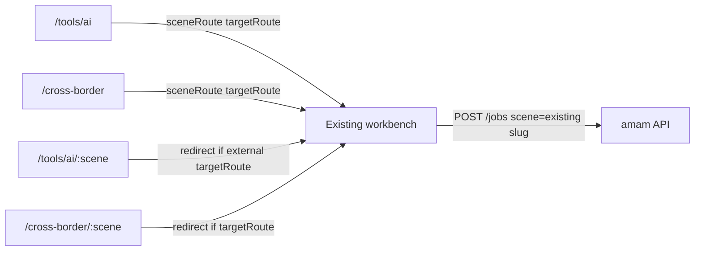

# Toolbox Cross-border Reuse

Feature Name: toolbox-crossborder-reuse
Updated: 2026-10-09

## Description

SenseNova Token Plan 无视频生成接口，P4 暂缓。把工具箱剩余出图入口和跨境套图入口改为复用已有工作台。不新增契约、不改 Worker、不改进度照与分析类场景。

## Architecture

`/tools/ai/ai-edit` 等已有专用工作台路由保持在 catch-all 之前。catch-all 只重定向 `targetRoute` 与当前路径不同的入口。

## Components and Interfaces

### 工具箱出图映射

| slug | targetRoute |
| --- | --- |
| `product-explode` | `/product-images/detail-sheet` |
| `logo-design` | `/pod-images/print-design` |
| `image-translate` | `/tools/ai/ai-edit` |
| `product-pile` | `/product-images/product-composite` |
| `ai-text-edit` | `/tools/ai/ai-edit` |
| `multi-image-fusion` | `/product-images/product-composite` |
| `photo-style-transfer` | `/pod-images/style-transfer` |
| `lineart-studio` | `/derive-images/tech-sketch` |
| `smart-layout` | `/graphic-design/print-size` |
| `limb-fix` | `/tools/ai/ai-edit` |
| `clothes-fix` | `/product-images/wrinkle-remove` |
| `shoes-fix` | `/tools/ai/ai-edit` |

保持 `planned`：`id-photo`、`pro-portrait`、`art-portrait`、`pre-check`、`click-rate`。

### 跨境出图映射

| slug | targetRoute |
| --- | --- |
| `platform-image-set` | `/product-images/suite` |
| `language-size-matrix` | `/product-images/clothing-ztc` |
| `aplus-brand-story` | `/product-images/detail-page` |
| `sku-listing-pack` | `/product-images/sku-image` |

保持 `planned`：`listing-generate`、`listing-localize`、`listing-compliance`。

### `src/router.js`

`/tools/ai/:scene` 与 `/cross-border/:scene` 增加 `beforeEnter`：有外部 `targetRoute` 则跳转，否则进入方案页。

## Correctness Properties

1. 工具箱 12 个出图场景 `implemented`，5 个暂缓场景 `planned`。
2. 跨境 4 个出图场景 `implemented`，3 个文案场景 `planned`。
3. 每个已接入 `targetRoute` slug 命中 `sceneSchemas` 或既有本地工具路径。

## Test Strategy

在 `tests/generation-pipeline.test.js` 锁定上述映射。

## References

[^1]: `.monkeycode/specs/poster-ecommerce-reuse/requirements.md`
[^2]: `src/data/business.js` `sceneRoute`
